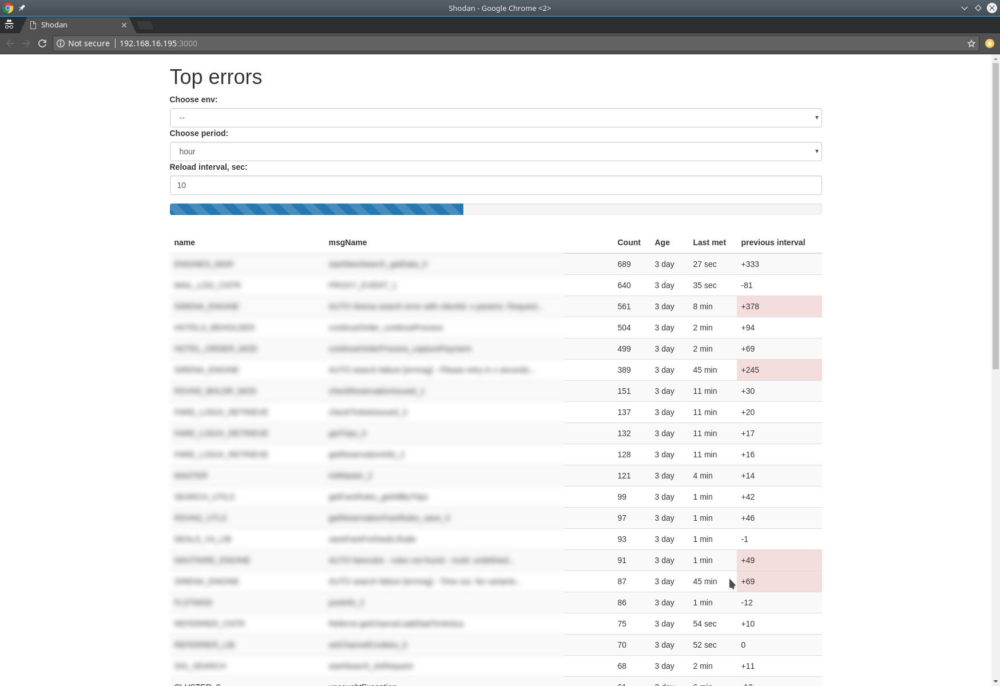
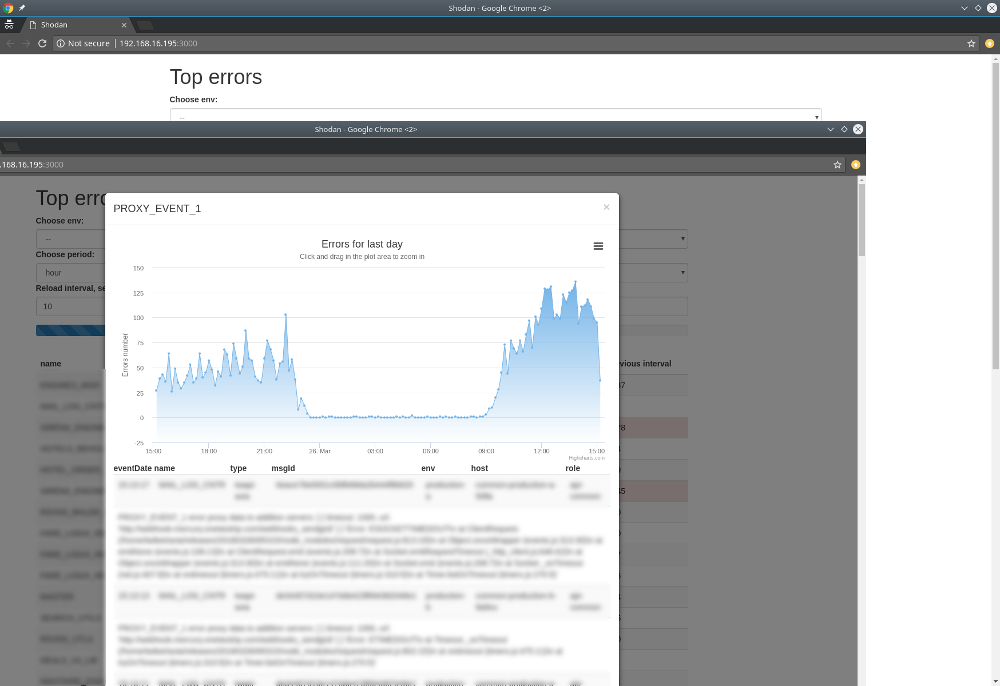

# Shodan

Advanced error monitoring using kibana logs.

## Screenshots

Dashboard:

Error details:

## Installation

### Requirements:

* node.js 8+
* mysql or mariadb 5+ (pull requests for Postgres welcome)
* kibana
* some free space to store your logs
* you should be able to run socket based interaction

### Installing

1. `git clone https://github.com/jehy/shodan.git`
2. `cp config/default.json config/runtime.json`
3. Set up `runtime.json` config (see below)
4. Run `./node_modules/.bin/knex migrate:latest` to set up DB
5. Run `npm i`
6. `npm run start`  and `npm run updater` (those are 2 different processes!)
7. Enjoy!

### Configuration

* `kibana`
    * `"cookie": "_oauth2_proxy=XXXXX"` your own kibana cookie
    * `"version": "5.5.2",`your kibana version
    * `"url": "https://logs.google.com",` your kibana url
    * `"firstSearchFor": 24,` first search should begin fetching entries from 24 hours ago
    * `"searchFor": 1,` new entries are fetched 1 lsat hour
    * `"lookInPast": 5` check for new entries in the past 5 minutes from current entry
    * `"preference": 1521709471107,` some preference id from kibana requests, dunno wtf
    * `"index": "some-app",` index name to search for
    * `"indexFilterOut": "",` filter for indices
    * `"fetchNum": 500,` max entries to fetch
    * `"updateInterval": 30,`how often we should fetch updates, in seconds
    * `"storeLogsFor": 7` for how many days do you want to store logs

*  `"userAgent": "Mozilla/5.0 (X11; Linux x86_64)",` useragent string to use for kibana search

*  `"db"` standard database options
    * `"client": "mysql",`
    * `"connection":`
        *  `"host": "127.0.0.1",`
        *  `"user": "your_database_user",`
        *  `"password": "your_database_password",`
        *  `"database": "myapp_test",`
        *  `"charset": "utf8"`
    * `"migrations":`
        *  `"tableName": "knex_migrations"`
